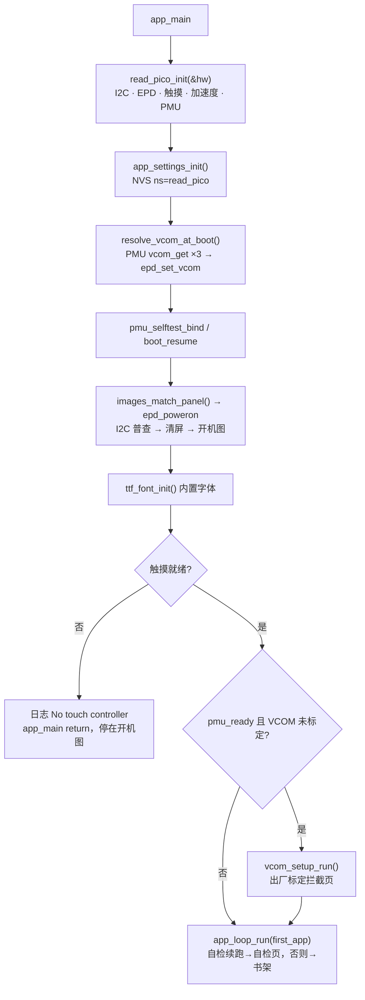

# 小纸 Pico 固件 · 新开发者上手指南 / Read Pico Firmware Onboarding

本文面向**第一次接触本仓库的人类开发者和 AI agent**。目标：读完后能搭好环境、编译烧写、看懂运行时结构、知道哪些地方不能碰、并且能在不同 agent / 不同会话之间无损地接手任务。

This document is for **first-time human developers and AI agents**. After reading you should be able to set up, build, flash, understand the runtime, know the no-go zones, and hand a task over between agents without losing state.

> 权威来源优先级 / Source of truth, in order:
> 1. 代码文件头里的 `冻结 / Frozen:` 段落（产品决策）
> 2. [AGENTS.md](../AGENTS.md)（规则、契约、术语表、注释规范）
> 3. 本文（背景、流程、操作手册、交接约定）
> 4. [README.md](../README.md) / [README.zh-CN.md](../README.zh-CN.md) / [README.ja-JP.md](../README.ja-JP.md)（产品概述、完整引脚表）
> 5. 官方在线文档：<https://dot.mindreset.tech/docs/read_0>（产品）、[/start](https://dot.mindreset.tech/docs/read_0/start)（基本操作）、[/firmware](https://dot.mindreset.tech/docs/read_0/firmware)（编译刷写）
>
> 如本文与上面 1–2 冲突，以 1–2 为准并修正本文。

---

## 0. 阅读顺序 / Reading order

| 身份 | 顺序 |
| --- | --- |
| 人类开发者，第一次 | §1 → §2 → §3 → §4 → §5 → §6 → §8 → §9 → §10 → §11 |
| AI agent，第一次进入仓库 | [AGENTS.md](../AGENTS.md) 全文 → 本文 §5、§6、§8、§9、§12 → [docs/HANDOFF.md](HANDOFF.md) |
| 任何人/agent，**接手一个进行中的任务** | `docs/HANDOFF.local.md` 最新条目（不存在 = 本机无进行中任务）→ `git status` / `git diff` → 本文 §12 → 再看任务涉及文件的 Frozen 段 |

---

## 1. 项目定位 / What this is

- **产品**：小纸 Pico（英文/日文文案：Read Pico；型号 RDP-G01-W；内部代号 Read/0，仅限内部使用，不得出现在对外文案）。深圳 MindReset 出品的 4.7 英寸墨水屏开发板。
- **本仓库**：在出厂演示固件 [MindReset/read_pico_firmware](https://github.com/MindReset/read_pico_firmware) 基础上裁剪出的**纯阅读固件**。菜单只有五项阅读页（书架 / 传书 / 字体 / 存储 / 设置），开机直接进书架；演示与诊断页已删除，设备自检只由开机断电续跑与设置页长按「关于」进入。
  1. 用户用它阅读 TF 卡或内置存储里的 TXT/EPUB。
  2. 开发者仍可以它的板级支持包（BSP）与芯片驱动为起点写自己的固件。
- **不是**：出厂演示固件。逐项检查硬件的页面不在本仓库，看演示功能请看上游。
- **许可**：主体 Apache-2.0；`components/epdiy` 为 LGPL-3.0-or-later（上游 epdiy v2.0.0 的裁剪 fork）；内置字体 ChillDuanSans 为 SIL OFL-1.1。复用/分发前看各组件 `LICENSE`。
- **仓库关系**：上游为 `MindReset/read_pico_firmware`。在 fork 上工作时把上游加为 `upstream` 远端；向上游提 PR 前请阅读 [CONTRIBUTING.md](../CONTRIBUTING.md)。
- **配套生态**：Dot Open Platform <https://github.com/MindReset/dot_open_platform>。

### 1.1 对外文案硬规则

中文文案写"小纸 Pico"，英文和日文文案写"Read Pico"。三份 README 必须同步更新。

---

## 2. 硬件速览 / Hardware at a glance

完整引脚表与型号见 [README.md](../README.md)。这里只给开发时最常查的部分。

| 模块 | 器件 | 接口 / 引脚 | 备注 |
| --- | --- | --- | --- |
| MCU | ESP32-S3，16 MB flash（Zbit ZB25VQ128）+ 8 MB Octal PSRAM | — | flash/PSRAM 真机 120 MHz，见 §4.3 |
| 墨水屏 | 4.7" E0470A01，1216×684，16 灰阶 | LCD 外设 16-bit 并口：D0–D15 = GPIO4–18、45；XLE/XSTL/XCL/SPV/CKV = 3/46/21/47/48 | 逻辑坐标为竖屏 684×1216 |
| 屏电源 | SY7636A | I2C | **只读**，不得写 VCOM/VLDO/放电/延时/VCOMCTL |
| 电源管理 | CW32L010（自定义 I2C 协议，地址 0x2A） | I2C；INT 经 FCA9555 P0.2 | README 写固件 1.0.8，实测板上为 1.0.9；协议 1.1；VCOM 存在这里 |
| 触摸 | CST836U，两点 | I2C；INT GPIO43 | 触摸不就绪时 `app_main` 直接返回，UI 不启动 |
| 加速度 | SC7A20H | I2C；INT1 GPIO1 | 设备坐标 Xd=-Yc, Yd=-Xc, Zd=-Zc |
| IO 扩展 | FCA9555 | I2C；INT# GPIO41（浅睡唤醒源） | Port-0：P0.0 MODE, P0.1 XOE, P0.2 CW_INT, P0.3 SY_EN, P0.4 VCOM_EN, P0.5 PGOOD, P0.6 SD_CD, P0.7 TP_RST；期望 CFG0 = 0x64 |
| TF 卡 | 1-bit SDMMC | CLK/CMD/D0 = 38/42/44 | 挂载点 `/sdcard`；字体目录 `/sdcard/assets/fonts`、`/sdcard/fonts` |
| 蜂鸣器 | 无源，GPIO2 | PWM / 1-bit | 三种驱动路径 CLASSIC / HF / DIRECT_1BIT |
| I2C 总线 | SCL 40 / SDA 39，400 kHz | Kconfig 菜单 "Read Pico board configuration" 可改 | |
| 按键 | 屏下三个触摸键区 KEY1/KEY2/KEY3 + 电源键（PMU） | — | KEY2 = 整屏 GC16；KEY3 = 菜单把手；电源键短按 = 锁屏。**没有 BOOT / RESET 物理键** |
| 调试口 | USB Serial/JTAG（VID 303A, PID 1001） | Windows 显示为 "USB 串行设备 (COMx)" | 端口号因机器而异，记在 `docs/HANDOFF.local.md`。烧写由 esptool `--before default_reset` 自动进下载模式，不需要按键 |

---

## 3. 环境搭建 / Environment

### 3.1 四条路径对比

| 路径 | IDF 版本 | 能烧写? | 适用 | 实测状态 |
| --- | --- | --- | --- | --- |
| **本机安装 ESP-IDF v6.1** | 钉死 v6.1 | 是（直连 COM 口，`idf.py flash monitor` 一条龙） | 日常开发首选 | 未实测 |
| **纯 `docker run` 编译**（§3.3） | `espressif/idf:v6.1` | 否；产物在宿主 `build/`，用 §3.4 从宿主烧 | 不想装 IDF、不想折腾 devcontainer | **已实测通过** |
| **devcontainer**（[.devcontainer/](../.devcontainer/)） | `devcontainer.json` 里 `build.args.DOCKER_TAG` 钉 v6.1 | 否（Windows 下容器看不到 COM 口）；同上从宿主烧 | 想在容器里用 IDF 扩展 / 调试 | 启动踩坑已解决（§13），编译路径同 docker run |
| **CI**（[.github/workflows/build.yml](../.github/workflows/build.yml)） | 容器 `espressif/idf:v6.1` | 否 | 编译回归（用 `sdkconfig.ci`） | 由 GitHub 跑 |

**必须 v6.1**：`components/read_pico/read_pico_flash_hpm.c` 依赖 v6 才有的 `esp_flash_chips/spi_flash_override.h`；[dependencies.lock](../dependencies.lock) 记录 `idf 6.1.0`。

**`latest` 不等于 v6.1**。实测 `espressif/idf:latest` 是 master 快照：编译在 `components/epdiy/src/output_lcd/lcd_driver.c` 报 `lcd_ll_select_clk_src` / `lcd_ll_set_group_clock_coeff` 参数类型不匹配，而且会把 `dependencies.lock` 里的 `idf` 版本改写成 `6.2.0`。看到这两个现象任何一个 = 你的 IDF 不是 v6.1。

### 3.2 本机 Windows 安装

1. 用 [ESP-IDF Windows Installer](https://dl.espressif.com/dl/esp-idf/) 或 VS Code 扩展 `espressif.esp-idf-extension` 安装 **v6.1**，目标 esp32s3。
2. 打开 "ESP-IDF 6.1 PowerShell" 或在 VS Code 里用扩展的终端（会自动 `export.ps1`）。
3. 验证：`idf.py --version` 输出 `v6.1…`。

本机工具链、容器、串口号等机器相关状态写进 `docs/HANDOFF.local.md` 的"环境备注"，不写进本文。

### 3.3 容器编译（docker run / devcontainer）

**最短路径（已实测）**——在仓库根目录的 PowerShell 里：

```powershell
docker pull espressif/idf:v6.1
docker run --rm -v ${PWD}:/workspaces/read_pico_firmware -w /workspaces/read_pico_firmware espressif/idf:v6.1 `
  bash -lc '. /opt/esp/idf/export.sh >/dev/null 2>&1; idf.py --version; idf.py set-target esp32s3; idf.py build'
```

- 第一次 pull 体积大；全量 build 约 786 个编译步骤，耐心等到 `Project build complete`。中途看进度：另开终端 `docker ps` 找容器名，`docker logs --tail 50 <name>`。
- 产物落在宿主 `build/`：`bootloader/bootloader.bin`、`partition_table/partition-table.bin`、`Read_Pico.bin`（app，约 1.9 MB）以及 `flash_args`。
- 容器 build 的副作用（Windows 检出）：`dependencies.lock` 会以 LF 写回，`git status` 显示 `M`。用 `git diff --ignore-cr-at-eol -- dependencies.lock` 确认无内容差异后 `git checkout -- dependencies.lock`。若内容真变了（如版本被改成 6.2.0），说明用错了镜像，回退并换 v6.1。
- 网络：`docker pull` 报 `TLS handshake timeout` / `failed to fetch oauth token` 是 Docker Hub 链路问题，配置代理后重试，不是镜像不存在。

**devcontainer**：`Dev Containers: Reopen in Container`。容器名 "ESP-IDF QEMU"，`--privileged`，预装 `espressif.esp-idf-extension` 与 `espressif.esp-idf-web`；`export.sh` 已写进 `~/.bashrc`，直接 `idf.py`。Windows + Docker Desktop + WSL 下的启动失败排障见 §13。进入后先 `idf.py --version` 核对 v6.1。

**容器里能不能直接烧？** Windows 宿主下不能：容器看不到 COM 口。选项：
- **方案 B（已实测）**：容器只编，宿主用 esptool 烧，见 §3.4。
- 方案 A（未实测）：[usbipd-win](https://github.com/dorssel/usbipd-win) 把 VID 303A 设备 attach 进 WSL2，容器里 `idf.py -p /dev/ttyACM0 flash monitor`。
- 方案 C（未实测）：`espressif.esp-idf-web` 扩展走浏览器 WebSerial。

### 3.4 宿主烧写与监视（无 idf.py）—— 已实测

前提：宿主 Python 有 `esptool`（实测 v5.4.0）和 `pyserial`：`pip install esptool pyserial`。

```powershell
cd build
python -m esptool --chip esp32s3 -p COMx -b 460800 --before default-reset --after hard-reset write-flash '@flash_args'
cd ..
python -m serial.tools.miniterm COMx 115200     # Ctrl+] 退出，看开机日志
```

**PowerShell 里 `@flash_args` 必须加引号**。裸写 `@flash_args` 会被 PowerShell 当成 splatting 语法展开成空，esptool 报 `Missing argument '<address> <filename>...'`；实测踩过。bash / cmd 不需要引号。esptool v5 的选项已改连字符（`default-reset` / `hard-reset` / `write-flash`），旧的下划线写法仍能用但会刷 Deprecated 警告。

**必须用 `@flash_args`，不要手写地址。** `flash_args` 由 IDF 生成，内容形如：

```
--flash-mode dio --flash-freq 80m --flash-size 16MB
0x0 bootloader/bootloader.bin
0x8000 partition_table/partition-table.bin
0x10000 Read_Pico.bin
```

`Read_Pico.bin` 只是 app，**必须落在 0x10000**。把它写到 `0x0` 会覆盖 bootloader、分区表、NVS、phy_init，设备不再启动——而墨水屏会保留上一帧画面，看起来"没坏"。这个错误已经在实测中发生过一次，用上面的命令全量重写后恢复（§13.2）。想要单文件烧写，先 `idf.py merge-bin` 生成合并镜像再写 0x0。

实测踩坑：
- 端口写 `COMx`，**不要写 `\\.\COMx`**。后者在 esptool 5.x 下报 `Failed to get VID/PID` + `Write timeout`，很容易被误判成"没进下载模式"。
- 本板**没有 BOOT / RESET 按键**。USB Serial/JTAG 由 `--before default-reset` 自动拉进下载模式，不需要按任何键。连不上先换端口写法、再拔插 USB。
- 只读握手检查：`python -m esptool --chip esp32s3 -p COMx --after no-reset chip-id`。能连上并打印 MAC（S3 没有 chip id，esptool 会改读 MAC，这是正常的）才继续 `write-flash`。
- esptool 报 `Hash of data verified` 只说明字节写对了，**不等于设备能启动**。烧完必须看串口。"真机已验证"的最低证据是下面三行都出现：
  ```
  I (...) boot: Loaded app from partition at offset 0x10000
  I (...) app_init: ESP-IDF:          v6.1
  I (...) app_loop: UI ready on 图书 Books
  ```
  中间还应看到 `read_pico: I2C scan: 4 device(s)`（CST836U / SC7A20H / FCA9555 / CW32）和 `panel VCOM loaded from PMU`。没看串口只能写"已烧写未验证启动"。
- `--after hard-reset` 会让 USB Serial/JTAG 重新枚举，端口消失约 1 s 再回来；miniterm 要在烧完后立即开，最早几行 ROM 日志可能看不到，不影响判据。想重演开机日志，跑一次 `python -m esptool -p COMx --before default-reset --after hard-reset read-mac` 等于按一次复位，接着用 pyserial 重试打开 `COMx` 读 10 s 即可（agent 无法用交互式 miniterm 时用这条路）。

### 3.5 串口识别（Windows）

```powershell
[System.IO.Ports.SerialPort]::GetPortNames()
Get-CimInstance Win32_PnPEntity | Where-Object { $_.PNPDeviceID -match 'VID_303A' } | Select-Object Name, PNPDeviceID, Status
```

期望看到 `USB 串行设备 (COMx)` + `USB JTAG/serial debug unit`，PNPDeviceID 含 `VID_303A&PID_1001`。设备在跑固件时串口读缓冲会有日志字节（`BytesToRead > 0`），可作为"真实连通而非仅枚举"的证据。

> agent 提示：沙箱化终端可能无法访问 WMI / Docker 命名管道 / MSIX 打包版 pwsh 与 `WindowsApps\python.exe` 垫片。设备枚举、Docker、esptool 请在非沙箱终端执行（或用 conda / 完整路径的 python），或让人类执行后把结果贴进 `HANDOFF.local.md`。

### 3.6 唤醒后 USB 不识别（官方排障顺序）

1. 换一根 USB Type-A **数据线**重试。
2. 再做一次睡眠 → 唤醒重试。
3. 重启开发板重试。

---

## 4. 编译 / 烧写 / 监视 / Build, flash, monitor

### 4.1 标准命令（本机有 idf.py）

```bash
idf.py set-target esp32s3        # 首次或换目标；会生成 sdkconfig（已 gitignore）
idf.py build
idf.py -p COMx flash monitor     # Ctrl+] 退出 monitor
idf.py size                       # CI 也跑这一步
```

`idf.py flash` 内部就是 `esptool write_flash @flash_args`，三段镜像各归其位。没有 idf.py 的宿主走 §3.4。

烧写会**覆盖**设备出厂应用固件，但按当前 `flash_args` 不会写入 NVS；睡眠模式 / 字体选择 / 自检结果会保留。VCOM 在 PMU 里，不受影响。分区表 [partitions_16M.csv](../partitions_16M.csv)：nvs 0x9000/0x5000、phy_init 0xE000/0x1000、factory app 0x10000/2 MB、spiffs 0x500000/5 MB（当前代码未挂载 spiffs，仅预留）。

### 4.2 CI 等价编译（只验证能不能编过）

```bash
idf.py -DSDKCONFIG_DEFAULTS=sdkconfig.ci set-target esp32s3
idf.py build
idf.py size
```

### 4.3 两套 sdkconfig 的边界

| 文件 | 用途 | 关键差异 |
| --- | --- | --- |
| [sdkconfig.defaults](../sdkconfig.defaults) | **产品默认**，真机用 | flash 120 MHz + HPM（HPM_DC 关）、Octal PSRAM 120 MHz、`SPIRAM_TIMING_TUNING` 类温度调优 **保持关闭**（板上 Zbit 0x5E 不在 IDF 验证表里，开了会在 `do_system_init_fn` abort）、64 KB 数据缓存 / 64 B 行、CPU 240 MHz、USB Serial/JTAG 控制台、FreeRTOS 1000 Hz、性能优化 |
| [sdkconfig.ci](../sdkconfig.ci) | **仅编译检查** | PSRAM 80 MHz、无 120 MHz/HPM、`COMPILER_WARN_WRITE_STRINGS=y` |

规则：不要把 CI 时序当产品默认；不要把 `sdkconfig.defaults` 用到别的硬件上；`sdkconfig`（生成物）永远不提交。

### 4.4 生成物与忽略项

`.gitignore` 忽略：`.vscode/`、`build/`、`sdkconfig`、`managed_components/`、`*.bin`（保留 `main/assets/*.bin`）、`tools/fonts/`。**不要提交这些**。

---

## 5. 仓库地图 / Repository map

详细职责表见 [AGENTS.md](../AGENTS.md) "目录职责"。下面是"我要改 X 该去哪"的速查。

| 我想… | 去这里 |
| --- | --- |
| 加一个页面 | `main/apps/app_xxx.c` + [main/app/app_registry.c](../main/app/app_registry.c) `s_apps[]` + [main/CMakeLists.txt](../main/CMakeLists.txt) `SRCS` |
| 改菜单顺序 | [main/app/app_registry.c](../main/app/app_registry.c) |
| 改刷新档位（GL16/GC16/DU、多少次软刷后压一次 GC16） | [main/app/app_config.h](../main/app/app_config.h) |
| 改推屏、pclk、轨道空闲断电 | [main/display.c](../main/display.c) |
| 改锁屏 / 浅睡 / 深睡 / 拿起唤醒 | [main/sleep.c](../main/sleep.c)、[main/apps/app_settings.c](../main/apps/app_settings.c)（睡眠设置入口） |
| 加一个 NVS 设置项 | [main/settings.c](../main/settings.c)（命名空间 `read_pico`） |
| 改排版常量、公共绘制原语 | [main/ui/ui_kit.h](../main/ui/ui_kit.h) / `ui_kit.c` |
| 改两层菜单 / 三键区几何 | [main/ui/ui_menu.h](../main/ui/ui_menu.h) / `ui_menu.c` |
| 字体渲染、TF 卡字体加载 | [main/font/ttf_font.h](../main/font/ttf_font.h) / `ttf_font.c` |
| 重新生成内置字体子集 | [tools/gen_builtin_font.py](../tools/gen_builtin_font.py) → `main/assets/builtin.ttf`（扫描 UI 字串 + `main/font/charset.txt`，≤700 KB） |
| 开机图 / 锁屏图 | 源图 `assets/image/*.png` → `main/assets/*_4bpp.bin`（4bpp，尺寸必须等于 w×h/2，`images_match_panel()` 会校验） |
| 板级初始化、I2C 普查、EPD 扫描时序、TF 卡、蜂鸣器、flash HPM | [components/read_pico/](../components/read_pico/) |
| PMU 协议（CW32L010） | [components/read_pico_pmu/](../components/read_pico_pmu/)；线格式 `include/read_pico_pmu_protocol.h`；给 LLM 的完整说明 `docs/llms-full_zh_cn.md` / `llms-full_en.md`；寄存器表 `docs/pmu_registers_*.json` |
| 出厂自检 / VCOM 标定 | [main/factory/](../main/factory/) |
| 面板波形 | [components/e0470_epaper_waveform/](../components/e0470_epaper_waveform/)（`waveforms/*.h` 是数据表，**勿手改**；改波形失去保修） |
| 连续 DU | [components/continuous_du/](../components/continuous_du/) |
| 蜂鸣器乐谱离线试听 | [tools/buzzer_score_wav.c](../tools/buzzer_score_wav.c)（宿主机 `cc` 编译，出 WAV） |

### 5.1 生成物 / 第三方文件：不要手改

- `main/font/fallback.h`、`main/font/stb_truetype.h`
- `components/e0470_epaper_waveform/waveforms/*.h`
- `components/epdiy/**`（上游裁剪 fork，改动清单在其 LICENSE；**连注释整理都不要做**）
- `main/assets/*.bin`、`main/assets/builtin.ttf`（用 tools 重新生成）

---

## 6. 运行时结构 / Runtime

### 6.1 开机流程（[main/app_main.c](../main/app_main.c)）



### 6.2 主循环（[main/app/app_loop.c](../main/app/app_loop.c)）——不要改它来加功能

每 5 ms 一轮（`LOOP_TICK_MS`）：

1. 读 CST836U → 去抖 → 区分屏内触摸 / 屏下三键区（`ui_menu.h`：`UI_KEY_AREA_TOP` 1300，pitch 160，中心 x=80/240/400）。
2. 按键路由（全局，不交给页面）：
   - **KEY2**：除菜单关闭时 `owns_keys` 页面自行接管外，整屏 GC16 重画当前页或当前菜单页（复用页面 `render()`，所以 `render()` 必须纯）。
   - **KEY3 / 右下"把手"**：KEY3 在菜单关闭且 `owns_keys` 时交给页面；其余情况与把手均切换全屏一级菜单（打开时定位到当前页所在的菜单叶）。
   - **菜单打开时的 KEY1**：菜单上一叶；菜单里的"上一页/下一页"触摸区翻叶；点条目切页。
   - **菜单关闭时的 KEY1** → 页面 `on_key(UI_KEY_1)`（页面自己决定含义，通常是翻页）；屏内触摸 → `on_touch()`。
3. 手势页使用 `on_gesture` 替代 `on_touch`；主循环在全局中断/重绘边界发 CANCEL。菜单条目按下高亮、同项抬起切页，滑出取消。
4. `request_app` / `request_menu` 在 `on_tick` 后统一消费（切页优先）；输入已有请求则跳过旧页 tick。`request_app` 非空 → `switch_to()`：`on_exit` → `on_enter` → `enter_full ? FULL : PAGE`。
4. `rails_idle_check`：屏电源轨空闲 8 s（`RAILS_IDLE_TIMEOUT_MS`）断电。
5. 电源键短按 → `enter_lock_and_sleep()`，除非当前页 `holds_pmu`。开机后 2 s 内忽略（`APP_LOCK_IGNORE_BOOT_MS`）。
6. TF 卡字体延迟加载重试（每 3 s）。
7. `on_tick()`。
8. 首帧永远 `APP_REDRAW_FULL`。

### 6.3 页面契约 `app_desc_t`（[main/app/app.h](../main/app/app.h)）

权威定义在 AGENTS.md。要点：

| 回调 | 可以做 | 不可以做 |
| --- | --- | --- |
| `render(ctx)` | 只画 fb | I2C 写、蜂鸣、睡眠、改设置（KEY2 会随时复用它） |
| `on_enter` / `on_exit` | 上电/掉电传感器、拉首帧数据 | — |
| `on_touch` / `on_gesture` / `on_key` / `on_tick` | 任何副作用 | 直接推屏（用返回值让主循环推） |
| `present` | 自定义推屏；返回 true = 已刷完 | — |
| `area_hint` | 返回 `APP_REDRAW_AREA` 时的局部矩形 | — |

返回值怎么选：

- 只动一个数字/一块 → 自己先画好 fb，返回 `APP_REDRAW_AREA`（DU）。
- 整页内容变了 → `APP_REDRAW_PAGE`（均衡档 GL16）。
- 换页/怕残影 → `APP_REDRAW_FULL`（`APP_PAGE_FORCE_FULL` 时 GC16）。
- 自己已经 `present` 过 → `APP_REDRAW_DONE`。

标志：`enter_full`（进页整屏，当前 book / transfer / font_pick / settings 开着）、`holds_pmu`（独占 PMU，当前 selftest 开着；开着时电源键短按不锁屏）。

### 6.4 刷新策略（[main/app/app_config.h](../main/app/app_config.h) + [main/display.c](../main/display.c)）

- 档位 `APP_REFRESH_PROFILE`：`BALANCED`（默认：页 GL16、定稿 GC16、动态 DU、每 14 次软刷强制一次 GC16 压灰底）或 `ALL_DU`（实验，只看速度）。
- 波形（[components/e0470_epaper_waveform](../components/e0470_epaper_waveform/)）：`E0470_WAVEFORM`（裁剪 GC16 36 相 / GL16 37 相 + 阈值 DU）、`E0470_FULL_WAVEFORM`（48/48/DU 20）、`E0470_GRAY8_WAVEFORM`（30 相，约 360 ms）、`E0470_FOLLOW_WAVEFORM`（开机生成 8 帧，跟手数字用）。帧周期 11090 µs（约 90 Hz）。
- pclk：默认 18 MHz，安全 12，最大 24。`EPD_DRAW_EMPTY_LINE_QUEUE` 时自动降到 12 MHz 并刷白。
- 术语（DU / GC16 / GL16 / 跟随 DU / 连续 DU / 跟手 / 定稿 / 把手）见 AGENTS.md 术语表，注释里不要再解释。

### 6.5 睡眠与锁屏（[main/sleep.c](../main/sleep.c)、[main/settings.c](../main/settings.c)）

- 模式 `app_sleep_mode_t`：LIGHT 0 / DEEP 1（默认）/ OFF 2。
- 浅睡：`app_light_sleep_wait()`，唤醒源 IOE INT（GPIO41 低电平）+ 可选拿起（SC7A20H，350 mg / 3 拍，带静默窗口）。
- 软睡/关机：`app_enter_host_sleep()` 经 PMU 执行，**不返回**。
- NVS 键（命名空间 `read_pico`）：`sleep`(u8)、`font`(str，空 = 内置)、`lwake`、`lboot`、`pickup`。自检结果在命名空间 `pmu_st` 键 `blob`（magic 0xAA）。

### 6.6 PMU 协议要点（[components/read_pico_pmu](../components/read_pico_pmu/)）

- 64 字节帧，magic 0xA5，CRC16-CCITT-FALSE，`session_id = boot_id`，事件 FIFO 深 8。
- 电源状态：OFF, POWERING_ON, BOOT_WAIT, RUNNING, SHUTDOWN_PENDING, RESETTING, DOWNLOAD_MODE, FAULT, SOFT_SLEEP。
- 主机 API：`read_pico_pmu_refresh/poll/get/cmd/action`、`vcom_get/set`（0x0510/0x0511）、`uid_get`、`take_key_short/wakeup`、`report_ready/report_sleep/power_off`。
- **VCOM 只存在 PMU**。主机开机读一次，不落 NVS，产品页无修改入口；`vcom_setup.c` 是未标定时的出厂拦截页，唯一会调 `vcom_set` 的地方。
- 完整协议说明给人看 PDF，给 agent 看 `docs/llms-full_zh_cn.md`。

---

## 7. 页面与冻结决策速查 / Pages & Frozen decisions

菜单顺序 = [main/app/app_registry.c](../main/app/app_registry.c) `s_apps[]`。每页文件头都有 `冻结 / Frozen:` 段，**改行为前必须先改那段并说明决策为何变化**。摘要（以文件头为准）：

| 页 | 文件 | 标志 | Frozen 摘要 |
| --- | --- | --- | --- |
| 书架 / 阅读 | `app_book.c` | enter_full, owns_keys | 手势入口接管三键为上页/工具条/下页；工具条保留强刷，长按中键或把手开演示菜单；翻页抬起提交；晃动实验默认关只翻下页；`render()` 只绘图 |
| 传书 | `app_transfer.c` | enter_full | 热点与已有 WiFi 双模式，离页停网；`render()` 只画快照；停止后回到进入前位置；联网后给网址二维码 |
| 字体 | `app_font_pick.c` | enter_full | 列表行高 `UI_BTN_H`；点选即换字体；字重只有细/常规/粗三档，存 NVS 全局生效；不提供字形缓存跑分；换字体或字重整屏 GC16 |
| 存储 | `app_storage.c` | — | 无字体走 `ui_draw_no_font_page`；格式化两次确认（**会清空卡**）；底栏只留菜单把手；阅读版去掉蜂鸣器与探针区 |
| 设置 | `app_settings.c` | enter_full | 底栏只留菜单把手；自检只在长按「关于」标题进入；字号 36..72 步长 4；拿起唤醒默认关 |
| （隐藏）设备自检 | `app_selftest.c` | holds_pmu | 底栏只留探测 / 清空；不等闹钟、不目视灯、不断电续跑 |
| （出厂）VCOM 标定 | `factory/vcom_setup.c` | 非菜单页 | 副标题不写范围；数字带只用 FOLLOW DU；三位合法自动进确认；不写 ESP NVS |

---

## 8. 常见任务操作手册 / Playbooks

### 8.1 加一个页面

1. 复制一个结构相近的页（维护类抄 `app_storage.c`，交互类抄 `app_transfer.c`）到 `main/apps/app_xxx.c`。
2. 写文件头（SPDX + 中文/English 职责 + 冻结/Frozen），只实现需要的回调，末尾导出一个 `const app_desc_t app_xxx`。
3. `main/CMakeLists.txt` `SRCS` 加文件；`main/app/app_registry.c` `s_apps[]` 加条目（位置即菜单顺序）。
4. 若用了新组件，`REQUIRES` 加上。
5. UI 字串若含新汉字，运行 `python tools/gen_builtin_font.py` 重新生成 `builtin.ttf`，否则显示为缺字。
6. **不要改 `app_loop.c`**。
7. 编译 → 真机走一遍：进页、KEY2 强刷、菜单切走再切回、电源键锁屏回来。

### 8.2 改一个页面的行为

先看文件头 Frozen 段。命中 → 先改 Frozen 文本并在 PR / HANDOFF 里写为什么；未命中 → 直接改，仍然保持 `render()` 纯。

### 8.3 加一个 NVS 设置

`settings.h` 加 getter/setter → `settings.c` 在命名空间 `read_pico` 下加键（短名，≤15 字符）→ 默认值写在读取失败分支。不要新开命名空间，除非像自检那样有独立生命周期。

### 8.4 读 PMU 数据 / 发命令

用 `read_pico_pmu_*` API，不要自己拼 I2C 帧。对照 `components/read_pico_pmu/docs/llms-full_zh_cn.md` 查命令码与 ACK 语义。禁止：`vcom_set`（除 `vcom_setup.c`）、出厂复位、硬复位。

### 8.5 波形 / 时序禁区

- 不改 `waveforms/*.h`；要试新裁剪参数走 `e0470_waveform_trim.c` 的 API（默认 erase_max 11 / sat_cut 5 / white_sat_cut 0 / hold 3）。
- 不改 `sdkconfig.defaults` 的 120 MHz 与 HPM 相关项；不开 `SPIRAM_TIMING_TUNING`。
- pclk 只在 12–24 MHz 内调，且优先改 `display.c` 常量而不是散落调用。

### 8.6 换开机图 / 锁屏图

把 PNG 放 `assets/image/`，转成 4bpp 灰度 raw（尺寸 = 1216×684 竖屏，字节数 = w×h/2），覆盖 `main/assets/*_4bpp.bin`。启动时 `images_match_panel()` 会校验大小。

---

## 9. 硬约束清单 / Hard rules (checklist)

来自 AGENTS.md，整理成可勾选项：

- [ ] 对外文案：中文"小纸 Pico"，英日"Read Pico"；Read/0 不出现。
- [ ] 没有改任何 `冻结 / Frozen:` 段落覆盖的行为——或者先改了段落并说明理由。
- [ ] 没有写 SY7636A 的 VCOM / VLDO / 放电 / 延时 / VCOMCTL。
- [ ] 没有在 `vcom_setup.c` 以外调用 `read_pico_pmu_vcom_set`；没有把 VCOM 写进 NVS。
- [ ] 没有碰 `components/epdiy/**`、`main/font/fallback.h`、`stb_truetype.h`、`waveforms/*.h`。
- [ ] 没有动 `sdkconfig.defaults` 的 120 MHz / HPM / PSRAM 项。
- [ ] 没有改 UI 字面量或日志字符串（除非任务明确要求）。
- [ ] `render()` 仍然纯。
- [ ] 没有改 `app_loop.c` 来加页面功能。
- [ ] 没有提交 `sdkconfig`、`build/`、`.vscode/`、`managed_components/`。
- [ ] 三份 README 同步。

---

## 10. 代码与注释风格 / Style

- 格式：[.clang-format](../.clang-format)（Google 基础，4 空格，100 列，指针贴类型，`else` 跟右括号）。
- 注释**全仓中英双语**，规范在 AGENTS.md "注释规范"。速记：
  - 文件头固定模板（SPDX 2026 mindreset / Apache-2.0 → 中文职责 → English → 冻结 → Frozen）。
  - 头文件公开 API 与 struct 成员 `///`；`.c` 内部 `//`；不要 `/** */`。
  - 单行 `// 中文。/ English.`；多行中文一行紧跟英文一行；enum 尾注 `///< 中文 / English`。
  - 大 `.c` 用 `/* ---- 区块名 / Section ---- */` 分区。
  - 术语表里的词不再解释。
- 只改注释的 PR 不得改逻辑；不给未改动代码补注释/类型。

---

## 11. 验证与提交 / Verification & PR

### 11.1 验证等级（账本与 PR 必须声明其一）

| 标签 | 含义 |
| --- | --- |
| `未编译` | 只改了文件，没跑 build |
| `已编译 ci` | `-DSDKCONFIG_DEFAULTS=sdkconfig.ci` 通过 |
| `已编译 defaults` | 默认配置 build 通过（还未上板）。写明在哪里编的：本机 IDF / docker run / devcontainer |
| `已烧写未验证启动` | esptool `Hash of data verified` 了，但**没开串口看开机日志**。必须附烧写命令原文（尤其地址）。不得写成"真机已验证" |
| `真机已验证` | 必须附：板型 RDP-G01-W、IDF 版本、串口、供电（USB/电池）、串口里看到的开机日志片段、验证了哪些页/操作、未覆盖项 |

墨水屏会保留上一帧，"屏幕还显示着内容"不是设备在跑的证据。只有串口日志或能响应触摸/按键才算。

### 11.2 PR 规范（[CONTRIBUTING.md](../CONTRIBUTING.md) + `.github/PULL_REQUEST_TEMPLATE.md`）

- 一个 PR 只解决一个问题。
- 如实说明做过的检查（编译 vs 真机、板 rev、IDF 版本、电源状态）。
- 保留 SPDX 与第三方声明；不含凭据/私有 ID（PMU UID、MAC 等不要贴进文档）。
- PR 不含 `docs/HANDOFF.local.md`（已 gitignore）、不含任何"本机观察"（串口号、本机路径、fork 远端名）。
- 三份 README 一起改。
- 提交信息沿用仓库现有风格：`type: summary`（如 `docs: standardize product naming…`），type ∈ feat / fix / docs / refactor / chore / ci。正文可中英双语。
- **git 身份**：`user.name` / `user.email` 未配置时会报 `Author identity unknown`。由人类自己填（GitHub 用户名 + `<id>+<user>@users.noreply.github.com`）；agent **不得从 `git log` 推断身份**——最近提交的作者很可能是上游维护者，已经错过一次。
- 推送前 `git remote -v` + `git push --dry-run`，确认目标是自己的 fork（`origin`）而不是 `upstream`。
- 容器 build 后只因 EOL 变脏的 `dependencies.lock` 不要提交（§3.3）。

---

## 12. Agent 协作与交接约定 / Multi-agent collaboration & handoff

开发者会混用多种 agent（Copilot、Claude、Cursor、Gemini、Codex……）和多次会话。**任何 agent 的私有记忆、聊天记录、会话摘要都不是仓库状态**——它们随会话丢失。能跨 agent 存活的只有：**工作区里的文件**。其中规则与协议入库共享，任务状态留在本机、不入库。

### 12.1 文件职责与交付边界 / File ownership and delivery boundary

| 文件 | 管什么 | 谁改 | 变化频率 | 入库? |
| --- | --- | --- | --- | --- |
| [AGENTS.md](../AGENTS.md) | 规则、契约、术语、硬约束、注释规范 | 维护者，走 PR | 低 | 是 |
| [docs/ONBOARDING.md](ONBOARDING.md)（本文） | 背景、环境、流程、操作手册、交接约定 | 任何人，发现过期就修 | 中 | 是 |
| [docs/HANDOFF.md](HANDOFF.md) | 交接**协议与模板** | 维护者，走 PR | 低 | 是 |
| `docs/HANDOFF.local.md` | **当前机器上进行中任务的状态账本** | 每个 agent / 人在每次交接点更新 | 高，每次会话 | **否**（`.gitignore`） |
| `docs/local/` | 内部计划、过程审查、检查点和验收记录 / Internal plans, reviews, checkpoints and acceptance records | 当前执行者 | 按需 | **否**（`.gitignore`） |
| [docs/CHANGELOG.md](CHANGELOG.md) | 按版本简述功能变化 / Brief user-visible changes by version | 功能维护者 | 随版本 | 是 |

对外交付功能实现、可复跑测试、功能说明和必要维护契约；Git保留实现历史，内部过程记录不代替版本管理，也不进入功能提交。只有需要交接未完功能或责任时，按HANDOFF协议提供必要摘要。
Deliver implementation, reproducible tests, feature documentation and necessary maintenance contracts. Git retains implementation history; internal process records stay local. Use the handoff protocol for unfinished functionality or responsibility when needed.

账本不入库的理由：条目里是某台机器、某个人、某次会话的临时状态（串口号、本机工具链、半成品、agent 名）。靠 `.gitignore` 兜底，而不是靠"提 PR 前记得剔掉"。需要跨机器交接时，把最新条目贴到 PR 描述 / draft PR / issue 评论。

其他 agent 专用入口文件（`CLAUDE.md`、`GEMINI.md`、`.cursorrules`、`.github/copilot-instructions.md`、`.clinerules` 等）**目前不存在**。若某工具必须要一个，只允许写一行桥接：

```
Read AGENTS.md, then docs/ONBOARDING.md, then docs/HANDOFF.md. Do not duplicate rules here.
```

不得把 AGENTS.md 内容复制进去，避免多份规则漂移。

### 12.2 什么时候必须写 HANDOFF

- 切换到另一个 agent / 工具 / 模型之前。
- 会话即将结束，或 agent 提示上下文即将压缩/重置。
- 任务要挂起超过一次会话。
- 完成一个可独立验证的里程碑（编过了 / 上板过了）。
- 准备开始一个会耗尽上下文的长操作（大范围重构、整仓注释）之前——先记下计划。

### 12.3 接手方（新 agent / 新会话）的第一步

按顺序，不要跳：

1. 读 [AGENTS.md](../AGENTS.md)。
2. 读本文 §5、§6、§9、§12（已经熟悉可只看 §9、§12）。
3. 看 `docs/HANDOFF.local.md`。**不存在** → 本机无进行中任务，跳过后面几步正常开工。存在 → 读**最新一条**：目标、已做、未做、验证等级、Frozen 触碰情况。
   - 账本最新条目比 `git status` / `build/` 时间戳 / 终端历史旧，说明前任没写交接。先从这些证据**重建**一条（标注 "由 <你> 从 … 重建，非当事人所写"），再继续。不要假装那段历史不存在。
4. 跑 `git status --short` 和 `git diff --stat`，对照账本的"涉及文件"。不一致 → 先在账本追加一条"接手时发现的差异"，不要擅自 `git checkout -- .`、`git stash` 或删除不明文件。
5. 打开任务涉及的每个文件，重新读一次文件头的 Frozen 段。
6. 如果账本声称"已编译"，且你的环境能编，**重新编译一次**再继续；声称"真机已验证"的内容不要重复烧写，除非你改了它。声称"已烧写未验证启动"的，先开串口看一眼再决定要不要重烧。
7. 在账本顶部追加"接手"条目（agent 名 + 时间 + 简述），再开工。

### 12.4 交接方（即将离开的 agent / 人）的检查单

- [ ] `docs/HANDOFF.local.md` 新条目已写，字段齐全（模板见 [docs/HANDOFF.md](HANDOFF.md)）。
- [ ] 验证等级如实（未编译就写未编译，不要写"应该能编"）。
- [ ] 列出**所有**改动文件，含新建文件；`git status` 里的每一个 dirty 文件都在列表里或注明"非本任务、勿动"。
- [ ] 触碰过的 Frozen 段已改文本并在账本说明理由；未触碰的写"无"。
- [ ] 没有留下只存在于聊天/agent memory 的关键决定——全部落到 HANDOFF 或代码注释。
- [ ] 没有提交/暂存 `sdkconfig`、`build/`、`.vscode/`、`managed_components/`、`docs/HANDOFF.local.md`。
- [ ] 若持有串口（monitor 未退出），已 `Ctrl+]` 释放。写明设备当前状态（在跑哪个固件、是否在睡眠/锁屏、是否需要重新烧）。
- [ ] 若本次烧过写，账本里贴了**烧写命令原文**（含地址 / `@flash_args`）和串口里看到的开机日志片段；没看串口就如实写"已烧写未验证启动"。
- [ ] 下一步写成可直接执行的动作（"在 `app_xxx.c` 的 `on_touch` 里处理 KEY1 翻页" 而不是 "继续做"）。
- [ ] 未解决的疑问单列，并注明你倾向的答案与理由。

### 12.5 HANDOFF 条目模板

模板与字段说明维护在 [docs/HANDOFF.md](HANDOFF.md)，只保留一份，避免漂移。复制到 `docs/HANDOFF.local.md` 顶部（最新在上）；文件不存在就新建。

### 12.6 分支与提交约定（便于多 agent 不互踩）

- 一个任务一个分支：`<type>/<area>-<short>`，如 `feat/apps-battery-graph`、`docs/onboarding`、`fix/sd-remount`。不要在 `main` 上直接改。
- 小步提交；每个提交信息 `type: summary`，正文可写验证等级。agent 生成的提交请在正文标注 `Agent: <名称>`，方便追溯。
- 不要 `git push --force`、不要 `git reset --hard`、不要 amend 已推送的提交。这些操作只允许人类决定并执行。
- 交接时**不要求**工作区干净，但要求账本与 `git status` 一致。
- `docs/HANDOFF.local.md` 永不入库：不 `git add -f`，不从 `.gitignore` 移除。跨机器交接走 PR 描述 / issue 评论。

### 12.7 并行冲突区（多 agent 同时工作时需串行）

这些文件是"热点"，两个任务同时改必冲突。开工前在账本声明你要改哪些：

- `main/app/app_registry.c`（菜单表）
- `main/CMakeLists.txt`（源文件列表）
- `main/app/app_config.h`、`main/display.c`（全局刷新行为）
- `main/ui/ui_kit.h`（排版常量，牵一发动全身）
- `main/assets/builtin.ttf`（二进制，无法合并；改了 UI 字串的人负责重生成）
- `AGENTS.md`、`docs/ONBOARDING.md`、三份 README
- **物理设备**：同一时刻只能有一个人 / agent 持有串口（烧写 / monitor）。烧写报 "could not open port" 先确认没人开着 monitor。

### 12.8 agent 能力边界与礼仪

- 沙箱化终端可能拿不到串口、WMI、Docker 管道。碰到就写进账本让人类或非沙箱会话执行，不要反复重试同一命令。
- 需要人工目视的验证（屏幕残影、蜂鸣声、灯）由人类完成并回填账本；agent 不得声称"真机已验证"。
- **烧写前必须读 `build/flash_args`**，用 `@flash_args` 或逐条照抄它的地址；不得自己"记得"一个地址。烧完必须开串口看启动，不能拿 esptool 的 verified 当成功。
- 报错要先区分"工具用法错"和"硬件状态错"。实测中 esptool 的 `Write timeout` 是端口写法 `\\.\COMx` 导致，却被当成"未进下载模式"让人类去按不存在的 BOOT 键。先查本文 §3.4 / §13，再让人类动手。
- 不确定的产品决策（尤其 Frozen）不要猜——在账本"未决问题"里列出，并给出倾向。
- 不推断 git 身份，不改全局 git 配置；让人类自己填（§11.2）。
- 只改任务要求的东西。看到"可以顺手优化"的地方，记进账本的建议区，不动手。
- 尊重 AGENTS.md 里"不要为注释去改它"一类的显式禁令，即使工具建议你格式化整个目录。
- 会话结束前写账本不是可选项。实测中有一次完成了编译 + 烧写却没留条目，接手者只能从终端历史重建。

---

## 13. 排障速查 / Troubleshooting

### 13.1 环境与工具（实测遇到过的都在这）

| 现象 | 原因 / 处理 |
| --- | --- |
| 编译在 `components/epdiy/src/output_lcd/lcd_driver.c` 报 `lcd_ll_select_clk_src` / `lcd_ll_set_group_clock_coeff` 参数不匹配 | IDF 不是 v6.1（多半是 `espressif/idf:latest`）。换 `v6.1` 镜像；不要去改 epdiy |
| `spi_flash_override.h` 找不到 | IDF 不是 v6.x。`idf.py --version` |
| 容器 build 后 `dependencies.lock` 变 `M` | `git diff --ignore-cr-at-eol` 为空 → 只是 EOL，`git checkout -- dependencies.lock`。若 `version: 6.1.0` 变成别的 → 镜像错了，回退并换 v6.1 |
| `docker pull` 报 `TLS handshake timeout` / `failed to fetch oauth token` | Docker Hub 链路问题，配代理后重试 |
| devcontainer 启动失败，日志里有 `--mount type=bind,source=\\wsl.localhost\<distro>\mnt\wslg\runtime-dir\wayland-0` 和 `stat /run/guest-services/distro-services/<distro>.sock: no such file` 或 `timed out waiting for /mnt/wslg/runtime-dir/wayland-0` | VS Code 想把 WSL 的 Wayland socket 挂进容器，Docker Desktop 挂不了 tmpfs。用户设置加 `"dev.containers.mountWaylandSocket": false`，然后 Rebuild and Reopen。镜像本身没问题，不用重建 |
| devcontainer 日志里 `code: 137` / `No such container` | 是 `up` 失败后 CLI `docker rm -f` 的后续现象，不是 OOM；看上一行 |
| `git commit` 报 `Author identity unknown` | 人类配 `user.name` / `user.email`（§11.2）；agent 不要从 log 猜 |
| 终端里中文提交信息乱码 | 控制台代码页问题（`chcp 65001` 或设 `$OutputEncoding`），文件本身是 UTF-8，不用改 |
| agent 沙箱里 `python` 报 `拒绝访问` / `参数错误` | 解析到了 `WindowsApps\python.exe` MSIX 垫片。用 conda / 完整路径的 python，或非沙箱执行 |

### 13.2 烧写与串口

| 现象 | 原因 / 处理 |
| --- | --- |
| esptool 报 `Missing argument '<address> <filename>...'` | PowerShell 把裸 `@flash_args` 当 splatting 吞了。写 `'@flash_args'` |
| esptool 刷 `Deprecated: Choice 'default_reset'` 警告 | esptool v5 改用连字符：`default-reset` / `hard-reset` / `write-flash`。仅警告，不影响结果 |
| esptool `Failed to get VID/PID of a device on \\.\COMx` + `Write timeout` | 端口写法。用 `COMx`，不要 `\\.\COMx`。不是下载模式问题，本板没有 BOOT 键 |
| esptool `Connecting...` 一直不动 | 拔插 USB 重试；确认没开着 monitor / miniterm；先跑 `chip-id` 做只读握手 |
| 烧写 `could not open port` | 其他 monitor / 串口工具占用；或设备在深睡——先按电源键 |
| 唤醒后 PC 看不到 COM 口 | §3.6 官方三步 |
| 烧完屏幕还是旧画面、串口没日志 | 墨水屏保留上一帧，设备可能根本没启动。查烧写命令的地址：`Read_Pico.bin` 是不是被写到了 `0x0` |
| **把 `Read_Pico.bin` 写到了 `0x0`**（bootloader / 分区表 / NVS 已被覆盖，屏幕无响应） | 恢复：`cd build; python -m esptool --chip esp32s3 -p COMx -b 460800 --before default-reset --after hard-reset write-flash '@flash_args'`，三段镜像重新归位。实测一次即恢复。NVS 内容（睡眠模式 / 字体 / 自检结果）丢失回默认；VCOM 在 PMU，不受影响。烧完看串口确认 §3.4 的三行判据 |

### 13.3 固件运行

| 现象 | 先看 |
| --- | --- |
| 开机日志 `W i2c.common: GPIO 39/40 is not usable, maybe conflict with others` | IDF 对 JTAG 引脚复用的例行警告，每次开机都有；I2C 普查随后正常即可忽略 |
| 开机 `do_system_init_fn` abort | 有人开了 PSRAM 温度调优；检查 `sdkconfig.defaults` 与本地 `sdkconfig` 差异，`idf.py fullclean` 后重配 |
| 开机图之后不进菜单，日志 `No touch controller, UI cannot run` | 触摸未就绪，`app_main` 直接返回（明确设计）。查 I2C 普查日志、TP_RST（FCA9555 P0.7）、INT GPIO43 |
| 开机停在一个三位数字页 | 这是 `vcom_setup` 出厂标定拦截，PMU 里没有 VCOM。不要在产品页加旁路 |
| 中文显示成缺字方块 | 新字串没进 `builtin.ttf`，跑 `tools/gen_builtin_font.py` |
| 刷新后屏边缘留边 | 页面切换用了 PAGE 而不是 FULL；给该页加 `enter_full = true` 或返回 `APP_REDRAW_FULL` |
| 刷新出现横条、随后自动变白 | `EPD_DRAW_EMPTY_LINE_QUEUE` 保护触发，pclk 已降 12 MHz；检查是否有别的核在抢 PSRAM 带宽 |
| 电源键短按不锁屏 | 当前页 `holds_pmu = true`（key / selftest），设计如此 |

---

## 14. 外部资源 / Links

- 产品页 <https://dot.mindreset.tech/docs/read_0>（规格：2050 mAh 电池、5 V 1.8 A 充电、Wi-Fi/BLE 5.0、117.5×66.2×7.3 mm、91 g）
- 开始使用 <https://dot.mindreset.tech/docs/read_0/start>
- 编译与刷写 <https://dot.mindreset.tech/docs/read_0/firmware>
- 上游仓库 <https://github.com/MindReset/read_pico_firmware>
- Dot Open Platform <https://github.com/MindReset/dot_open_platform>
- ESP-IDF v6.1 编程指南（esp32s3）<https://docs.espressif.com/projects/esp-idf/en/v6.1/esp32s3/>
- epdiy 上游 <https://github.com/vroland/epdiy>

---

*本文属于仓库文档，发现与代码不一致请直接修正并在 PR 中说明。/ This file lives with the code; fix it when it drifts.*

### 图书与传书的契约扩展 / Book and transfer contract extensions

`owns_keys` 只在菜单关闭时接管三键；图书工具条提供强刷，中键长按或把手打开演示菜单。传书组件不依赖页面；由 `app_transfer` 注入存储根、限额、容量回调。文件提交、删除或进度清理重试后通过书源 revision 请求下次进图书时重扫；文件变更回调只清对应路径进度。传书与阅读互斥，停止HTTP并等待退出后才切图书页，进度API由调用端串行化。
`owns_keys` captures three keys outside the menu; Books provides toolbar refresh; holding the middle key or using the handle opens the demo menu. Transfer receives storage policy from its page. File commits, deletions and metadata retries invalidate the shelf through a storage revision; an injected callback clears progress only for the affected path. Transfer and reading are exclusive; HTTP is stopped and joined before entering Books, serializing progress API callers.


传书页通过 `display_set_bulk_io` 在页内提高扫描预填余量，退出恢复默认；大文件进度用低频FOLLOW DU，结束/离页清残影。欠载恢复必须保留目标前缓冲，不能调用 `epd_hl_set_all_white` 丢掉整页。相关回归：`tools/run_display_host_test.sh`。
Transfer scopes additional scan prefill via `display_set_bulk_io`, restoring defaults on exit. Bulk progress uses infrequent FOLLOW DU with completion/exit cleanup. Underrun recovery must preserve the target front buffer; clearing it with `epd_hl_set_all_white` loses the page. Regression: `tools/run_display_host_test.sh`.

TTF 上传使用调用方注入的独立 TF 字体目录；`app_transfer` 进页用 `ttf_font_suspend_sd(true)` 切内置并暂停 SD 字体打开，先停 HTTP 再解除暂停，不能让写入与字形读取并发。TTF 提交前检查结构，上限 32 MiB，字体不调用图书进度清理。部署原件、来源和 OFL 许可见 `sdcard/README.md`，内置修改版使用独立字体名。
TTF uploads use a separately injected TF font directory. On entry, `app_transfer` calls `ttf_font_suspend_sd(true)` to select the built-in font and suspend SD opens; stop HTTP before resuming, preventing concurrent font replacement and glyph reads. TTF structure is checked before commit, with a 32 MiB cap and no book-progress cleanup. See `sdcard/README.md` for the original font, provenance and OFL; the modified embedded subset has its own font name.
